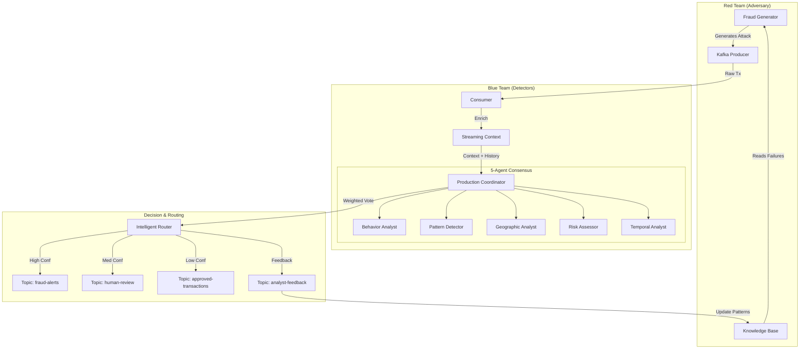

# Kafka Streaming Fraud Detection with AI Agents (GAN System)

A production-grade, real-time fraud detection system utilizing a **Multi-Agent GAN (Generative Adversarial Network)** architecture. The system features **5 specialized AI agents** powered by **Ollama (local LLM)**, real-time Kafka streaming, and a continuous learning loop where "Fraudster" AI and "Detector" AI learn from each other.


## 🌟 Key Features

### 🧠 Advanced AI Architecture
- **5-Agent "Blue Team" (Detectors)**:
  - 🔴 **Behavior Analyst**: Velocity patterns & automated behavior
  - 🟢 **Pattern Detector**: Known fraud signatures (card testing, etc.)
  - 🔵 **Geographic Analyst**: Location impossibility & travel time
  - 🟡 **Risk Assessor**: Financial deviation & merchant risk
  - 🟣 **Temporal Analyst**: Timing anomalies & scripted behavior
- **"Red Team" (Fraudster)**:
  - 🕵️‍♂️ **Fraud Generator Agent**: Learns from past detection failures to generate sophisticated, evolving attacks.
- **GAN-Based Learning Loop**: Detectors learn from caught fraud; Fraudsters learn from blocked attempts.

### ⚡ Real-Time Intelligence
- **Intelligent Routing (Layer 3)**: Confidence-based routing with feedback loop.
  - `fraud-alerts` (>80% confidence)
  - `human-review` (40-80% confidence)
  - `approved-transactions` (<40% confidence)
- **Streaming Context**: Real-time velocity tracking, customer profiling, and anomaly detection.
- **Knowledge Base**: Persistent JSON-based memory ("File API") for storing fraud patterns and analyst feedback.

### 🛠️ Tech Stack
- **AI/LLM**: Ollama (qwen2.5:0.5b - Local Inference)
- **Streaming**: Apache Kafka, Zookeeper, Kafka UI
- **Backend**: Python 3.8+
- **Containerization**: Docker Compose

---

## 🏗️ Architecture



---

## 🚀 Quick Start

### Prerequisites
- **Docker Desktop**: For Kafka ecosystem
- **Python 3.8+**: For the application
- **Ollama**: For local AI inference ([Download Ollama](https://ollama.com/))

### 1. Setup Environment

Clone the repository:
```bash
git clone https://github.com/Mukund-31/spa.git
cd spa
```

Run the automated setup (Windows):
```bash
setup.bat
```
*(Creates venv, installs dependencies, sets up .env)*

### 2. Prepare AI Model

Install and run Ollama:
```bash
# In a separate terminal
ollama serve
```

Pull the required model:
```bash
ollama pull qwen2.5:0.5b
```

### 3. Start Infrastructure

Start Kafka, Zookeeper and Kafka UI:
```bash
docker-compose up -d
```
*Access Kafka UI at [http://localhost:8080](http://localhost:8080)*

### 4. Run Interactive Demo

Launch the main demo application:
```bash
venv\Scripts\python.exe fraud_demo.py
```

---

## 🎮 Demo Scenarios

The `fraud_demo.py` script offers interactive scenarios:

1.  **Normal Transaction**: Simulates a legitimate grocery purchase (Auto-Approve).
2.  **High Velocity Attack**: Simulates a "card testing" attack (12 rapid transactions).
3.  **Unusual Amount Spike**: Simulates a sudden high-value purchase divergence.
4.  **🥊 AI vs AI (GAN Mode)**: 
    - The **Fraudster** generates a sophisticated attack using the Knowledge Base.
    - The **Detectors** analyze it using 5-agent consensus.
    - The result is logged to `analyst-feedback`.
    - **Round 2**: The Fraudster reads why it failed and *evolves* its strategy.
    - **Round 2**: The Detectors read the previous pattern and *adapt* their defense.

---

## 📂 Project Structure

```
spa/
├── agents/                 # AI Agents
│   ├── behavior_analyst.py
│   ├── pattern_detector_v2.py
│   ├── geographic_analyst.py
│   ├── risk_assessor.py
│   └── fraud_generator.py  # The Adversary
├── knowledge_base.py       # Persistent memory (File API)
├── intelligent_router.py   # Confidence-based routing
├── production_coordinator.py # 5-Agent Orchestrator
├── streaming_context.py    # Velocity & Profiling
├── fraud_demo.py           # Interactive CLI Demo
├── docker-compose.yml      # Kafka Infastructure
└── requirements.txt        # Dependencies
```

## 📊 Monitoring

- **Kafka UI**: [http://localhost:8080](http://localhost:8080)
  - Watch `analyst-feedback` to see the learning loop in real-time.
  - Watch `fraud-alerts` for blocked transactions.

## 🤝 Contributing

1. Fork the Project
2. Create your Feature Branch
3. Commit your Changes
4. Push to the Branch
5. Open a Pull Request

## 📝 License

Distributed under the MIT License. See `LICENSE` for more information.
